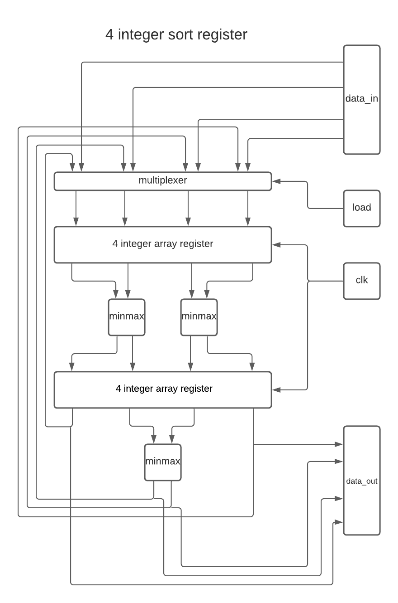

# Hardware Sorting Algorithm

The repository contains the design for a digital sorting device written in verilog.  If built, this device could sort any integer array in linear time provided the array width is less than or equal to the width of the device.  The width of the device can be as big as you want provided that it is an even number.  Arrays smaller than the width of the device can be sorted provided the upper unused
regesters are loaded with the largest integer that fits.  The number of
clock cycles taken to sort smaller arrays is proportional to their
width, not the width of the device.

A device like this could be added to a cpu as vector instruction.  Such an instruction could speed up a mergesort algorithm.  If a cpu had an 8 int sorting device, an array of 16 ints could be sorted with a recursion depth of 1 instead of 4.  Likewise, an array of 32 ints could be sorted with a recursion depth of 2.

## Simple Example
The design in the diagram has the smallest possible width.  It can be cascaded to accomadate longer arrays as seen in the code.  The cascade is purely horizontal, only two array registers are ever necessary.
